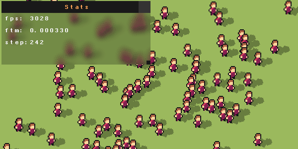

# rts

2D Framework
- header-only, (using unity build for testing, 1 x main.cpp)
- window, input, utils, containers, vulkan, network, memory
- vs code and shell scripts (no cmake)
- windows and linux support
- coding style: mixed oop with dod